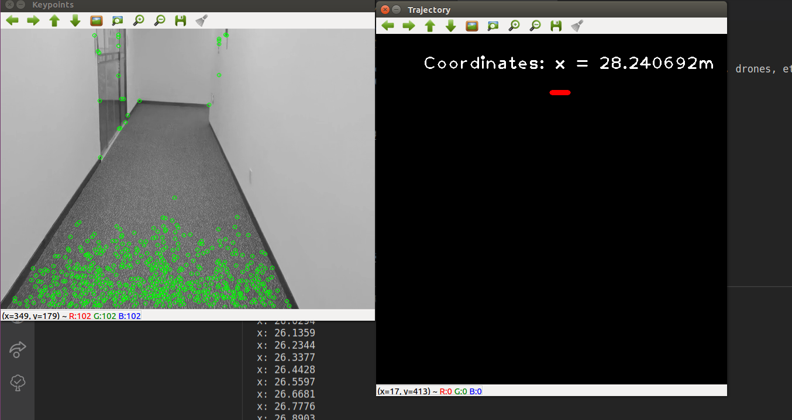

# Mono Odometry

Simply visual odometry using for tracking moving objects, such as *robots, drones, etc.* This program shows the basic usage of Mono Odometry. It track a moving object and get it's trajectory.


## 使用自己的数据集进行姿态估计

## Run
```
cd ~/mono_odometry
mkdir build
cd build
cmake ..
make
./mono_vo ~/test/images
```




## Blog

For reference, there are 2 splicity blog tells how this done.

https://zhuanlan.zhihu.com/p/34694111

And welcome to subscribe our zhuanlan:

- 人工智能从入门到逆天杀神: https://zhuanlan.zhihu.com/ai-man


